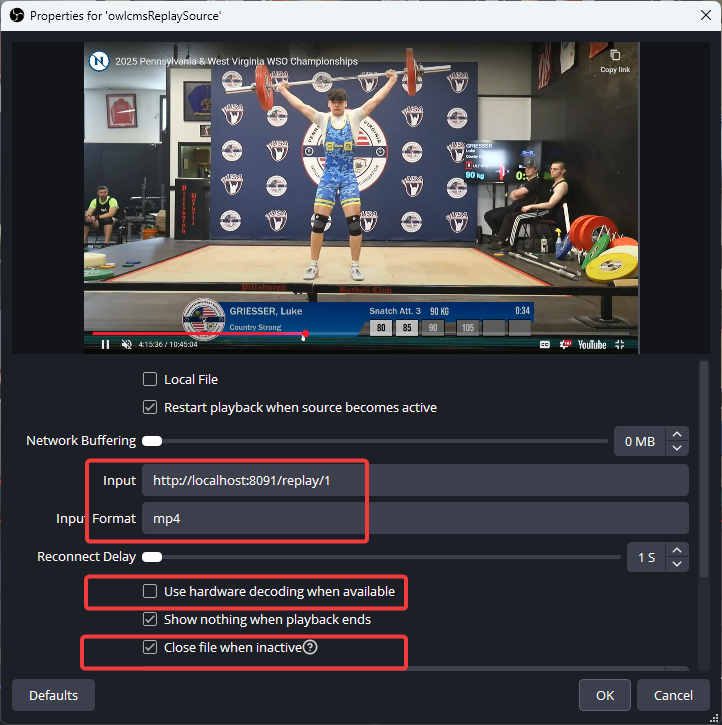
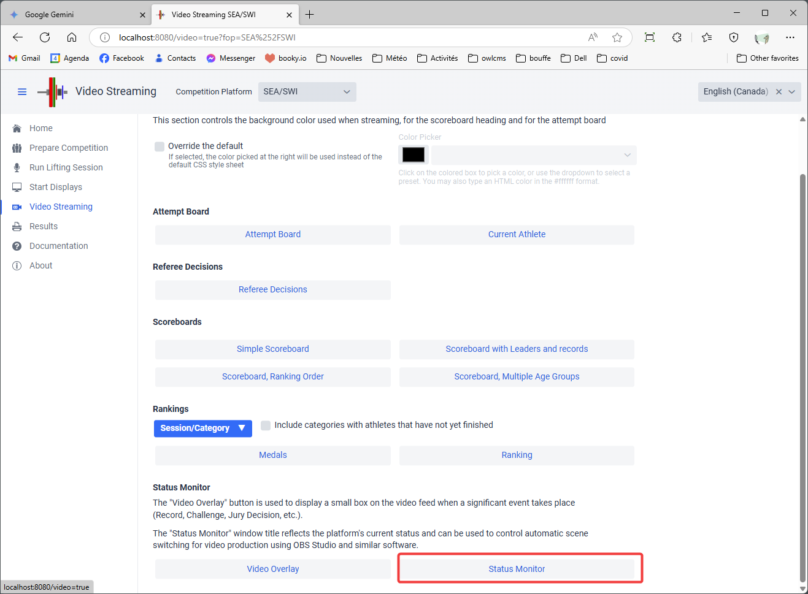
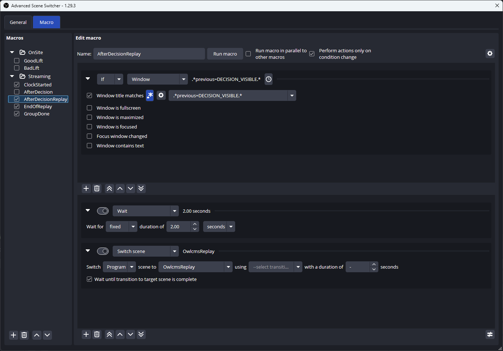
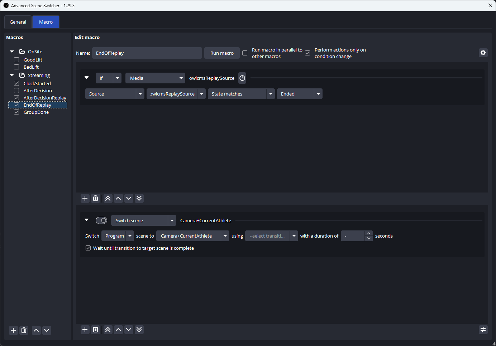

## Showing the Replays in OBS

The replays application exposes a `replay` endpoint.  Accessing the URL `.../replay/1` will fetch the last replay captured on camera 1.  If you define a *media source* in OBS to open that URL, you can include a replay in any of your scenes.

### 1. Defining the Replay Scene

You define a replay scene normally.  In this example, it is called `OwlcmsReplay`.  The scene will include a media source for playing the video.  In the following example, we define `owlcmsReplaySource`.   You need to replace `localhost` with the actual IP address of your replays server.

Note that some of the options have been unselected as they add to the delay of running the video.

### 2. Running the status monitor

In order for OBS to know when to switch to a replay, the machine that runs OBS needs to open a browser window on a special-purpose location.  We will configure an OBS plugin to look at window titles and react when a special value is shown.

To start the status monitoring window, go to Video Streaming and use the button at the bottom right.

### 3. Showing the Replay

You will need to install the [Advanced Scene Switcher plugin](https://obsproject.com/forum/resources/advanced-scene-switcher.395/).  The installers are available at [this location](https://github.com/WarmUpTill/SceneSwitcher/releases).

Start the plugin from the Tools menu in OBS.  Create a new macro as follows. Make sure the blue `.*` item is selected, and that the text is `.*previous=DECISION_VISIBLE.*` This matches what appears in the monitor title when the decision lights are turned off (a 3-second delay) 

Then two actions are triggered.

1. Normally, the 3-second delay after the decisions become visible should give the replay capture program enough time to stop recording and trim the video.  In this example, we add an extra 2 seconds. If your replay computer is fast enough, you may shorten this or remove it.
2. The second step tells OBS to switch to the scene where the replay is shown. 

### 4. Returning to the normal flow

OBS does not, on its own, have a way to detect that the replay media source has stopped playing. So we need a second macro to deal with this.

The macro detects the end of the `owlcmsDisplaySource` (top part).  It then switches to the scene you pick (could be the scoreboard, or the main camera, whatever you like.) 

### 5. Multiple Replays

If you want to show multiple angles, you will have one "end replay" macro for each camera. "end replay 1" macro will switch to the scene that shows "replay 2".  If "replay 2" is the last camera, then that macro switches to the normal scene.